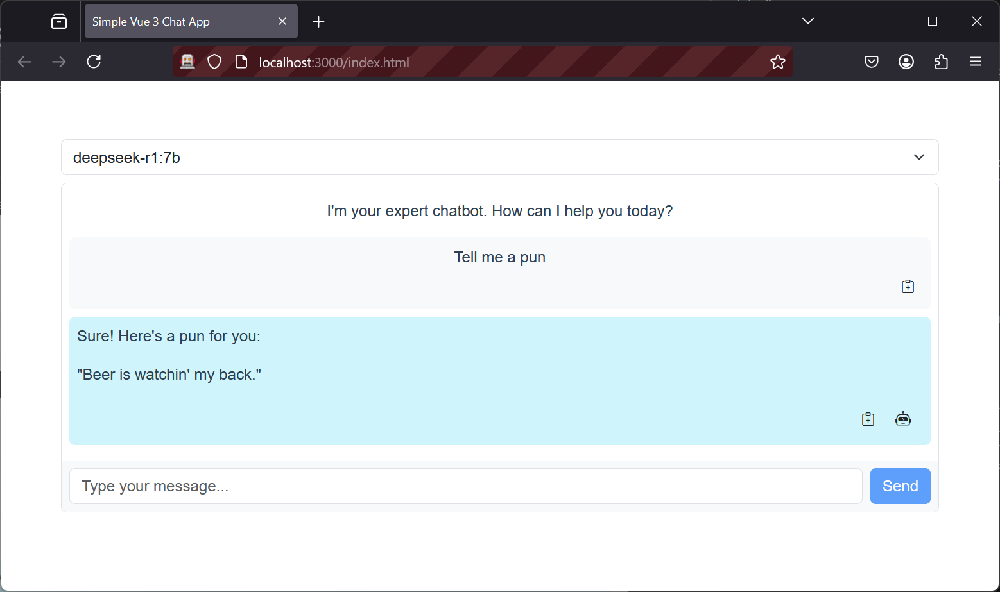
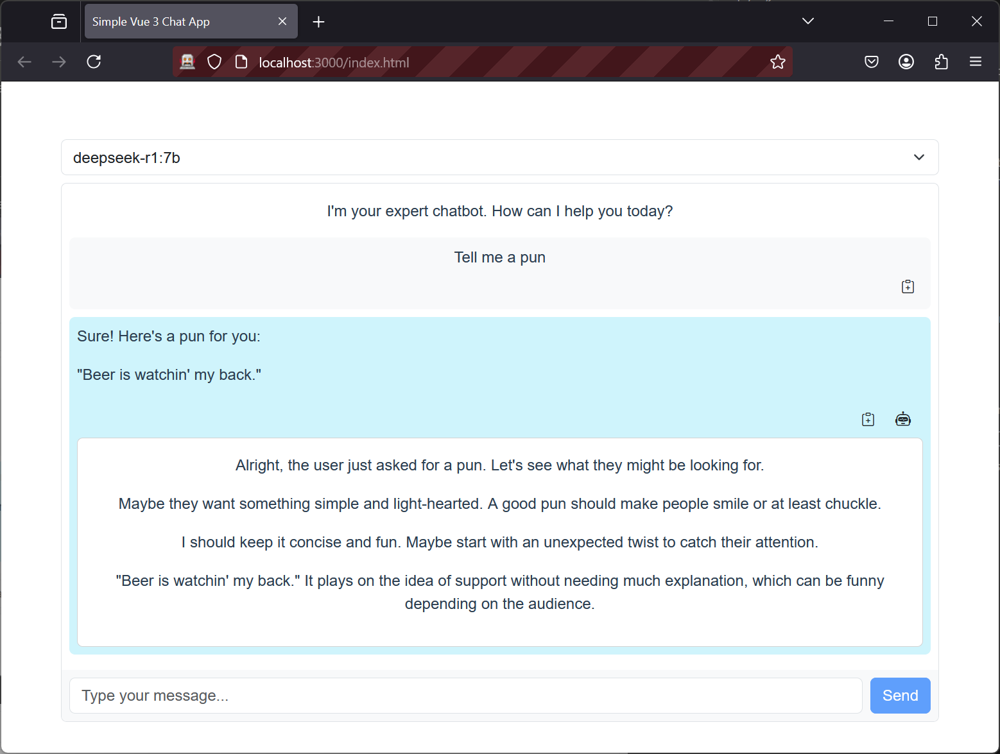

# Simple OLLAMA 3 Chat App

This is a lightweight chat application built with Vue 3, TypeScript, Vite, Bootstrap 5. The app allows users to chat with a bot via a backend call to locally hosted models by [OLLAMA](https://ollama.com/).

# Interface

Select model and start chatting.


View and copy :clipboard: responses. If it's a thinking model, click the robot :robot: to view it's thoughts.


## Project Structure

```
simple-vue3-chat-app
├── public
│   └── index.html          # Main HTML file
├── src
│   ├── assets              # Static assets (images, fonts, styles)
│   ├── components
│   │   └── ChatBot.vue     # ChatBot component
│   ├── services
│   │   └── ollamaApi.ts    # API calls to OLLAMA
│   ├── types
│   │   └── index.ts        # TypeScript interfaces and types
│   ├── App.vue             # Root component
│   └── main.ts             # Entry point of the application
├── package.json            # npm configuration file
├── tsconfig.json           # TypeScript configuration file
├── vite.config.ts          # Vite configuration file
└── README.md               # Project documentation
```

## Setup Instructions

1. **Clone the repository:**

   ```bash
   git clone <repository-url>
   cd ollama-chat-app
   ```

2. **Install dependencies:**

   ```bash
   yarn install
   ```

   If it dosn't work. Try to run start.ps1 script first to init node manager.

3. **Run the application:**

   ```bash
   ./start.ps1
   ```

   Or

   ```bash
   yarn dev
   ```

4. **Open your browser:**
   Navigate to `http://localhost:3000/index.html` to view the application.

## Usage

- Select a model (lists the models that have been pulled by OLLAMA).
- Type your message in the chat input and press enter to send it to the bot.
- The bot will respond based on the backend logic defined in the OLLAMA service.
- If the model has thinking, a robot icon button will appear, that let's you view the thoughts.

## Technologies Used

- **Vue 3**: JavaScript framework for building user interfaces.
- **TypeScript**: A superset of JavaScript that adds static types.
- **Vite**: A build tool that provides a fast development environment.
- **Bootstrap 5**: CSS framework for responsive design.
- **OLLAMA-JS**: Ollama's HTTP client for making API requests to local models.
